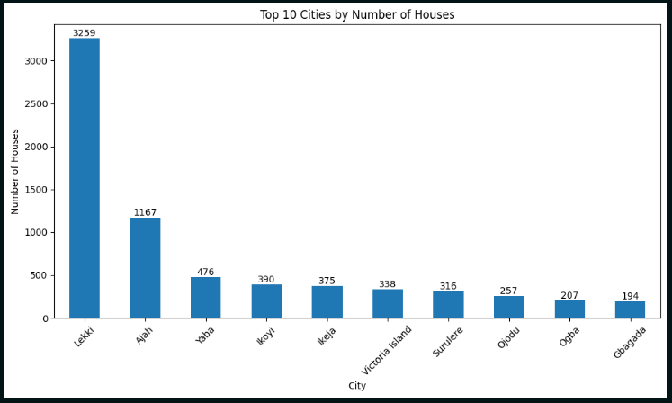

# Prediction of Urban House Rental Prices in Lagos - Nigeria: A Machine Learning Approach

This Reopsitory contains the dataset and code for the above paper published at ABUAD Journal of Engineering Research and Development (AJERD).Often, prospective tenants need to know the rental price of an apartment, and homeowners need to know how best to price
their apartments. This work aims to predict house rental prices in Lagos, Nigeria, using machine learning by examining the relationship
between the rental price and features such as the number of bedrooms, bathrooms, toilets, location and house status(newly built,
furnished, and/or serviced).

### Below is a visual representation of the top ten cities by number of houses:



The dataset used for this work was scraped from PropertyPro, a Nigerian real estate factor like housing type, number of
king space, and location that can influence property values on the 2nd of May, 2024 and contains house rents of apartments within Lagos State, Nigeria.

If you use our data, please cite this paper

```
Oluyele, Sunday, Juwon Akingbade, Victor Akinode, and Royal Idoghor. 2024. “Prediction of Urban House Rental Prices in Lagos - Nigeria: A Machine Learning Approach”. ABUAD Journal of Engineering Research and Development 7 (2). Ado-Ekiti, Nigeria, 216-28. https://doi.org/10.53982/ajerd.2024.0702.21-j.
```
